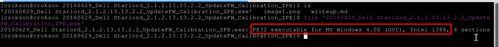
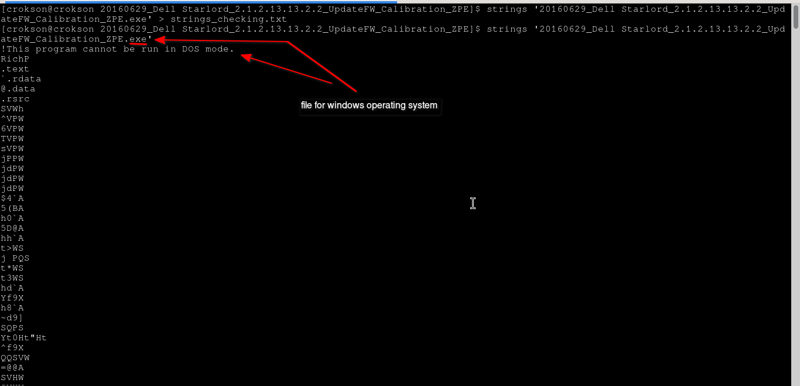
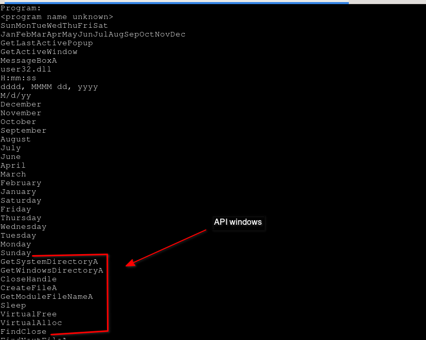
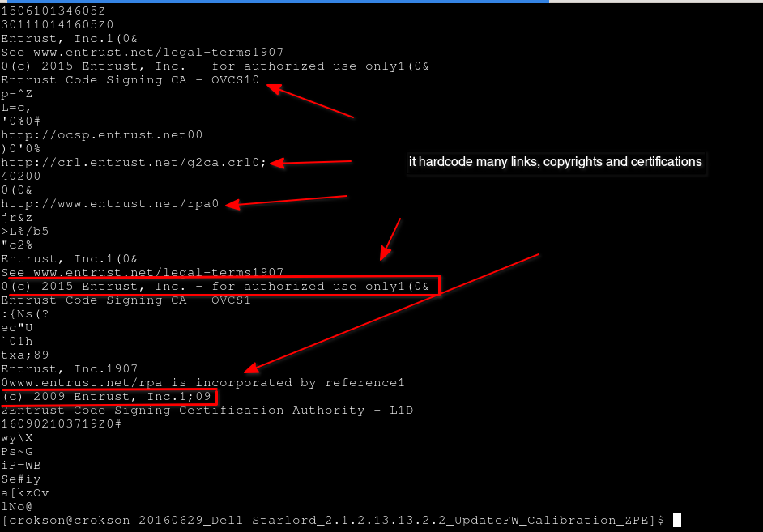

# Reverse the binary firmware update of DELL

Date starting writeup : 14/6/2026

Date finshed writeup :

**index**

- [1.what this firmware update?](#1what-this-firmware-update)

	- 1.1.What the firmware?

	- 1.2.What firmware update?

	- 1.3.Why we need update the firmware?

	- 1.4.Why firmware update is dangerous when interupt if it runnings?

- [2.What this file is type?](#2What-this-file-is-type)

	- 2.1.with file **(what this file?)**

	- 2.2.with strings **(what data can read hardcode in file?)**

	- 2.3.with binwalk **(what files hidden in the file binary?)**

	- 2.4.checking the file, sha256sum, size **(file have breaked or damaged when downloading about my system?)**

- [3.Debugging with ghidra](#3Debugging-with-ghidra)
	
	- 3.1.Import the file binary into ghidra

	- 3.2.What architecture firmware support and proof?

	- 3.3.why firmware read the binary when firmware is hardware run before operating system, proof?

- [4.Debugging with KVM windows10 and see how to works?](#4Debugging-with-KVM-windows10-and-see-how-to-works)

# 1.what this firmware update?

**1.1.What the firmware?**

- firmware is program hardcode in the mainboard, hardware computer. It uses running many code available when computer manufactured and reboot the operating system is BIOS. Here, it executing, controlling and configuring many hardware such as HDD disk, SSD disk, CPU, etc.

**1.2.What firmware update?**

- firmware update is the binary working when loaded it into firmware, can load it with windows or bios (need a USB device). It have mission is patch many vulnerabilities, errors and bugs. Make for firmware/bios working stabling and flexiblling better

**1.3.Why we need update the firmware?**

- Basically, we need update the firmware for firmware/bios working stabling and flexiblling better and patched the vulnerabilities and bugs

**1.4.Why firmware update is dangerous when interupt if it runnings?**

- Basically, when binary running and executing into firmware is perform stage updating the firmware, reason firmware is hardware/chip hardcode in mainboard and into it's many line code used execute bios. When interupt if it runnings perform stage updating and dont finished, consequences is brick, damaged or death the firmware and computer dont reboot, work, ran many hardware different in mainboard because firmware was death

# 2.What this file is type?

**2.1.with file**

- Here, we'll checking the file see what it's type.

> file '20160629_Dell Starlord_2.1.2.13.13.2.2_UpdateFW_Calibration_ZPE.exe'

result

here, we see exectaly it's type file for windows operating system and architecture intel i386.

**2.2.with strings**

- Here, we'll can reading what sequences hardcode in the binary

> strings '20160629_Dell Starlord_2.1.2.13.13.2.2_UpdateFW_Calibration_ZPE.exe'

because result to long, we have saved it into file `strings_checking.txt` you can see from it

Here, `!This program cannot be run in DOS mode.` is header for seeing it's program for windows, proof

it used API call windows

And here, we see it hardcode links, copyrights and certifications have many link using protocol http can old binary

**2.3.with binwalk**

**2.4.checking the file, sha256sum, size**

# 3.Debugging with ghidra

# 4.Debugging with KVM windows10 and see how to works?